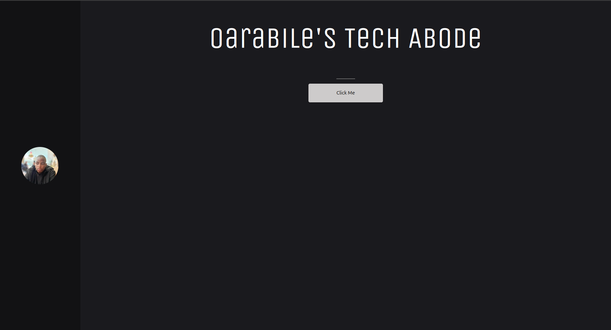

# MY WEBSITE



Here is my personal website in development written using my own framework.

To get started, clone the repository and run the following commands:

```
git clone https://github.com/oarabilekoore/oarabile-koore.git
cd oarabile-koore
bun install
bun run dev
```

# License

Its MIT License.
